<div align="center">



<h1>H.O.T-Jarvis</h1>

<p><b>An open-source, local-first AI assistant that grows its own skills, remembers how it reasons, tells you when it's unsure, and lets you undo anything. It runs on your machine, for free.</b></p>

[](https://github.com/Hotragn/H.O.T-Jarvis/actions/workflows/ci.yml)
[](https://github.com/Hotragn/H.O.T-Jarvis/releases)
[](LICENSE)
[](#quickstart)
[](https://github.com/Hotragn/H.O.T-Jarvis/stargazers)

<a href="#quickstart"><b>Quickstart</b></a> ·
<a href="docs-site/"><b>Docs</b></a> ·
<a href="landing/"><b>Landing</b></a> ·
<a href="ROADMAP.md"><b>Roadmap</b></a> ·
<a href="https://github.com/Hotragn/H.O.T-Jarvis/discussions"><b>Discussions</b></a>

</div>

---

## Why this one is different

The `jarvis` name is attached mostly to voice clones that open a website and read the weather. H.O.T-Jarvis has a sharper goal: an assistant you can actually trust, that gets more capable the more you use it, with nothing to pay and nothing leaving your machine. It ships as a real desktop app (Tauri v2), not a web demo, and every claim below is backed by tested code (around 90 tests, CI-gated).

## The four hero features

All four are built and tested, not roadmap items.

| | Feature | What it means |
|---|---|---|
| 🧩 | **Self-evolving skill library** | Ask for an ability and it writes the code and a test, proves the test passes, and refines on failure. Untested skills are flagged and refuse to run. |
| 🧠 | **Reflective reasoning-memory** | It re-reads its own action log, keeps short lessons about what worked and what failed, and applies them to future work. |
| 🎚️ | **Calibrated confidence** | Every answer carries a self-rated score. Below a threshold it asks a clarifying question instead of guessing. |
| ⏪ | **Replay and undo** | Every action is recorded and reversible, with an audit that proves the log reproduces memory exactly. |

Read the reasoning behind each in [docs: the four hero features](docs-site/src/content/docs/explanation/hero-features.md).

## Quickstart

Three commands to a running assistant that remembers you across restarts:

```bash
ollama pull llama3.2       # 1. free local model (install from https://ollama.com)
cp .env.example .env       # 2. optional: add a free Groq / OpenRouter key instead
npm install && npm run tauri dev   # 3. launch the desktop app
```

Prerequisites: [Node.js](https://nodejs.org) 20+, [Rust](https://rustup.rs) stable, and on Linux the [Tauri system deps](https://tauri.app/start/prerequisites/). Full walkthrough in the [quickstart guide](docs-site/src/content/docs/tutorials/quickstart.md).

## Desktop today, mobile next

The desktop app is real and running. iOS is planned, and the honest tradeoff is inference: there is no Ollama on a phone, so mobile keeps the local-first promise by acting as a companion to your desktop (with an on-device model or a free cloud tier as options). The rest of the core carries over unchanged.

<div align="center">



</div>

The full mobile plan, including the App Store readiness checklist, is in [docs/ios](docs/ios/README.md).

## Free, local, private by design

Inference runs on your machine through Ollama by default, with free cloud tiers (Groq, OpenRouter `:free`) only as a fallback. No paid API is ever required.

| Provider | Cost | Notes |
|---|---|---|
| Ollama (local) | Free, unlimited | Default. Private, nothing leaves your machine. |
| Groq | Free tier | Fast. Key at console.groq.com |
| OpenRouter `:free` | Free tier | Many models. Key at openrouter.ai |

The router prefers the local model, caches identical requests, and backs off from any cloud provider that rate-limits, so the app never pressures you to pay. Your conversations, skills, and memory live in a local folder you control, and you can export all of it as one JSON file or wipe it at any time.

## How it fits together

A Tauri v2 shell with a web UI over a Rust core. The rule is that all real logic lives in a Tauri-independent core, so every module is unit-tested without a webview.

```
src-tauri/src/core/
  router       local-first model routing + cache + backoff
  memory       SQLite (messages, facts, insights) + export/wipe
  skills       sandboxed Rhai skill engine (save, test, version, run, roll back)
  authoring    the assistant writing its own skills
  reflection   digests the event log into lessons
  confidence   the self-rating on every answer
  eventlog     append-only action log
  replay       rebuild-from-log + determinism audit
```

More in [docs: architecture](docs-site/src/content/docs/explanation/architecture.md).

## Project status

Released **v0.1.0** with all four hero features, plus voice output, a Jarvis-style HUD, a landing page, and a documentation site. Interface depth, local speech-to-text, and the autonomous work loop are next. See the [roadmap](ROADMAP.md).

## Contributing

The one hard rule: the assistant must stay free to run. Small pull requests with tests, green CI, conventional commits. See [CONTRIBUTING.md](CONTRIBUTING.md), [SECURITY.md](SECURITY.md), and [CODE_OF_CONDUCT.md](CODE_OF_CONDUCT.md). Licensed under [Apache-2.0](LICENSE).

## Acknowledgements

The hero features draw on ideas from the Voyager skill library, MUSE-Autoskill, Reflexion, ReasoningBank, "Hindsight is 20/20", Mem0, "Agentic Uncertainty Reveals Agentic Overconfidence", and the replayable-agent literature. Implementations here are original; the ideas are credited in [docs/DECISIONS.md](docs/DECISIONS.md).
